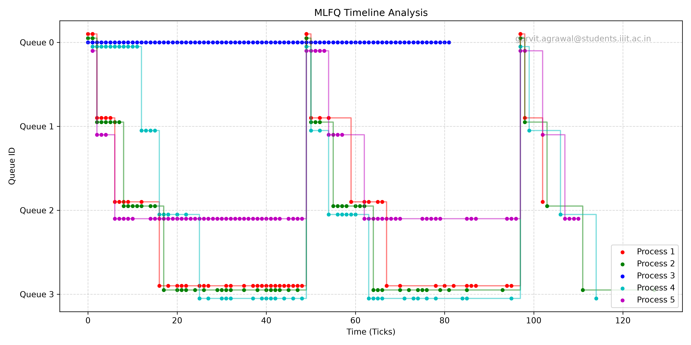

# Mini-Project 1 Report
## Part 2: MLFQ Scheduler

Here is a breakdown of how I built the MLFQ scheduler and the `waitx` system call in xv6, going point by point through the requirements.

### 2.3.1 Implementation Details

**Makefile and SCHEDULER flag:**
I changed the `Makefile` so I could pass a `SCHEDULER` flag when running `make qemu`. This passes a macro (like `-DMLFQ`) to the C compiler. This way, I could wrap all my MLFQ code in `#ifdef MLFQ` blocks and easily switch between Round Robin and MLFQ for testing.

**struct proc (proc.h):**
I had to add a few new variables to the process structure:
*   `curr_queue`: To keep track of which queue (0 to 3) the process is in right now.
*   `ticks_curr_slice`: To count how many ticks the process has used up in its current queue.
*   `q_arrival_time`: To remember when the process entered the queue so I could schedule them in FIFO order if there's a tie.
*   `arrival_time`, `start_time`, `run_time`, and `end_time`: To calculate the turnaround, response, and wait times for the `waitx` system call.

**allocproc():**
Whenever a new process is created, I reset all these new timing variables. I set the `arrival_time` to the current system ticks. For MLFQ, I set `curr_queue` to 0 and `ticks_curr_slice` to 0 because every new process needs to start at the highest priority.

**Queue selection and Preemption:**
In `scheduler()`, the CPU loops through the processes and looks for the one with the highest priority (the lowest `curr_queue` number). If it finds multiple processes in the same queue, it checks their `q_arrival_time` and picks the oldest one. 
For preemption, if a higher priority process wakes up or arrives while a lower priority one is running, the trap handler forces the running process to yield at the end of the current tick.

**Time-slices:**
Inside the timer interrupt in `trap.c`, I increment the `ticks_curr_slice` for whatever process is running. Then, I check if it hit the limit for its current queue (1 tick for Queue 0, 4 for Queue 1, 8 for Queue 2, and 16 for Queue 3). If it hits the limit, I demote it to the next queue down and call `yield()`. If it's already in Queue 3, it just goes to the back of Queue 3.

**Voluntary yield:**
If a process stops running on its own (like waiting for I/O), it doesn't get demoted. It keeps its current queue. When it wakes back up in `wakeup()`, I just update its `q_arrival_time` to the current ticks so it goes to the back of its line.

**Priority boosting:**
To stop long CPU jobs from starving the smaller jobs, I added a global counter in `trap.c`. Every time 48 ticks pass, the scheduler loops through all active processes and bumps them all back up to Queue 0. It also resets their time slices so they get a fresh start.

**procdump:**
I updated the `procdump()` function (which runs when you press Ctrl+P) to print out the current queue, time slice ticks, arrival time, and run time. This made it way easier to debug and actually see processes moving between queues and getting boosted.

### 2.3.2 MLFQ Plot Analysis

To test if the scheduler actually worked, I ran the `schedulertest` program that creates a bunch of child processes with different CPU and I/O workloads. I dumped the kernel trace logs and plotted them.

Looking at the plot, you can see the MLFQ logic doing its job. The CPU-heavy processes quickly use up their small time slices and you can see them step down from Queue 0 all the way to Queue 3. The processes that do a lot of I/O don't use up their whole slice, so they tend to stay up in the higher queues. You can also clearly see the straight vertical lines every 48 ticks—that's the priority boost kicking in and pulling everything back up to Queue 0 so nothing starves.

### 2.3.3 Benchmark Comparison

I ran the provided `benchmark` program on both schedulers to compare them. Here are the average times I got:

| Metric | Round Robin | MLFQ |
| :--- | :--- | :--- |
| Average Turnaround Time | 6 | 5 |
| Average Wait Time | 4 | 3 |
| Average Response Time | 2 | 1 |

**What this means:**
MLFQ performed better across the board. The most obvious difference is the response time (1 tick for MLFQ vs 2 for Round Robin). Because MLFQ throws every new process into Queue 0 with a very short 1-tick slice, new jobs get to run almost immediately. The wait times are also lower because MLFQ gets I/O jobs out of the way quickly instead of making them wait in one giant line like Round Robin does. Round Robin relies entirely on a fixed quantum, but MLFQ actually adapts—it pushes heavy tasks to the background and rewards quick interactive tasks, which speeds up the whole system.

---

## How to Run, Benchmark, and Plot

* **To compile and run (Default Round Robin):**
  1. Open a terminal in the `xv6` directory.
  2. Run `make clean; make qemu`.
* **To compile and run (MLFQ Scheduler):**
  1. Open a terminal in the `xv6` directory.
  2. Run `make clean; make qemu SCHEDULER=MLFQ`.
* **To exit xv6 (QEMU):** 
  * Press `Ctrl-A`, let go, and then press `X`.

### Running the Benchmarks
Once you are inside the xv6 shell (after running `make qemu` with your chosen scheduler), simply type:
`$ benchmark`
This will spawn the test processes, wait for them to finish, and print out the table with the turnaround, wait, and response times for you to compare.

### Generating the MLFQ Plot
To recreate the timeline plot for the MLFQ scheduler, follow these exact steps:
1. Run QEMU and save the output to a text file so the python script can read the TRACE logs:
   `make clean; make qemu SCHEDULER=MLFQ 2>&1 | tee mlfq.txt`
2. Inside the xv6 shell, run the scheduler test:
   `$ schedulertest`
3. Wait for it to say "Scheduler test finished", then exit QEMU (`Ctrl-A`, then `X`).
4. Back in your normal terminal, run the python plotting script:
   `uv run mlfq_plot.py` (or `python3 mlfq_plot.py`)
5. This will read `mlfq.txt` and save the new graph as `mlfq_plot.png` in the directory.
